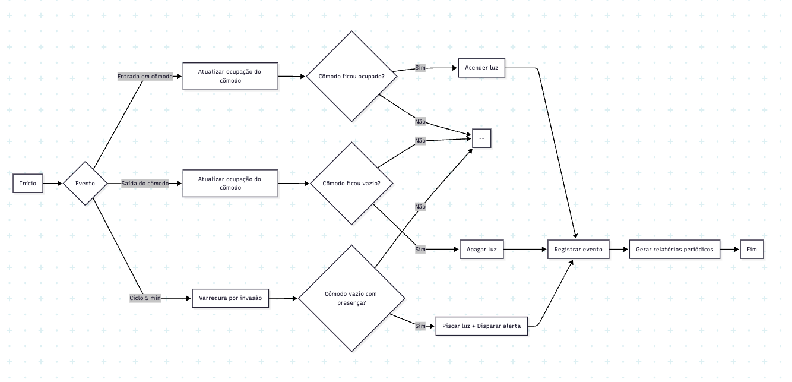
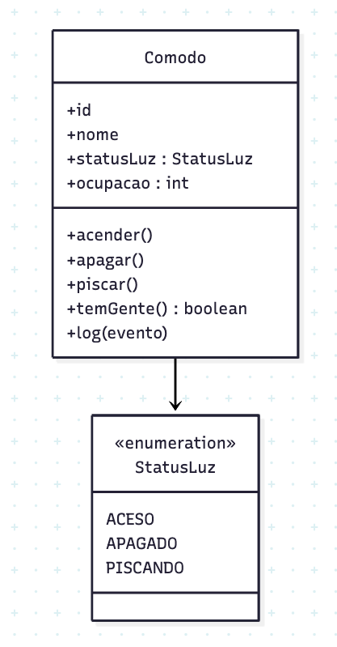
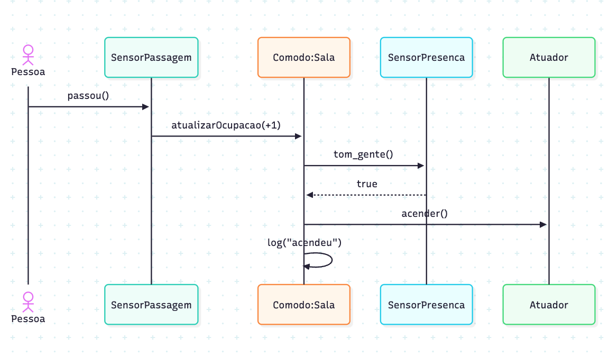
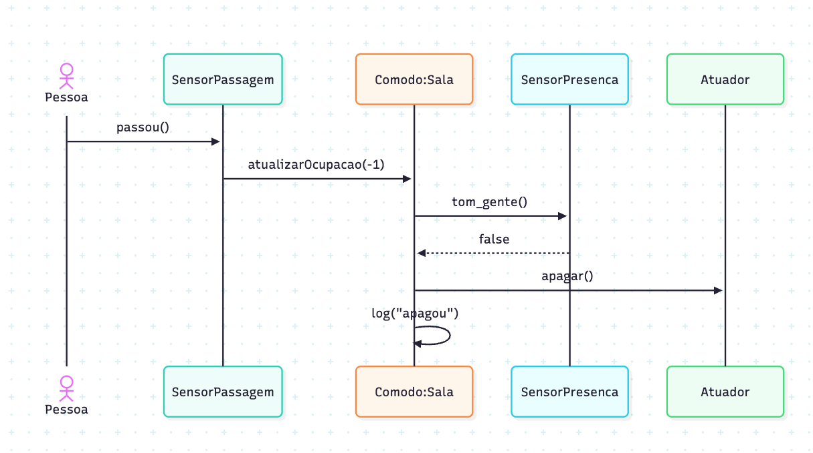
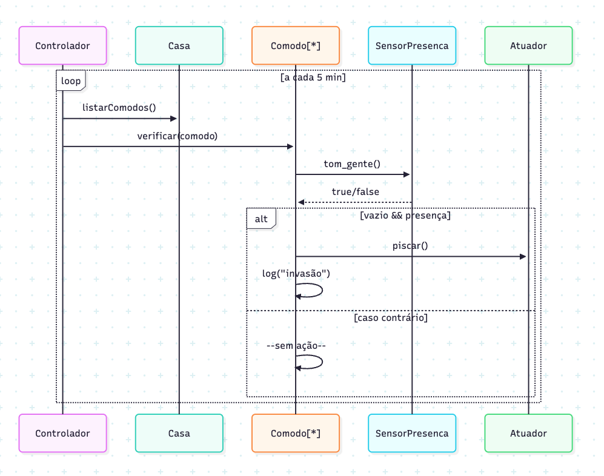
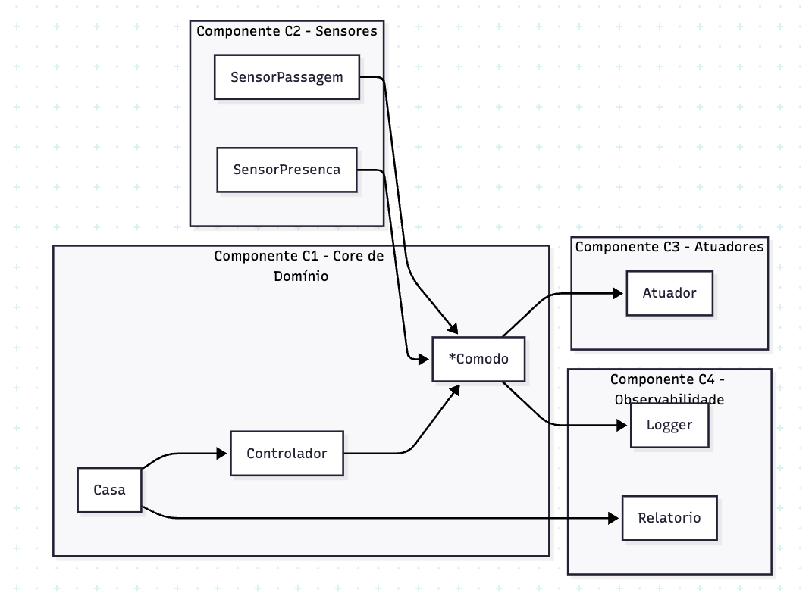

# Ponderada de Programação – Casa Automatizada

## Visão 1 – Business Drivers

**Objetivo do negócio:** Automatizar a iluminação e detectar invasões em uma casa do condomínio. Registrar eventos e gerar relatórios para gestão e segurança.

**Regras principais do processo:**
- Ao alguém entrar em um cômodo, acender a luz.
- Ao ficar vazio, apagar a luz.
- A cada 5 minutos, verificar invasão. Se o cômodo estiver vazio e houver presença, piscar a luz e registrar alerta.
- Registrar todos os eventos e gerar relatórios periódicos ao condomínio.

**Fluxo do processo:**

---

## Visões 2 e 3 – Requisitos Funcionais e Não Funcionais em UML

### 2.1 Modelagem Estática (Diagrama de Classes)
O diagrama de classes mostra Casa, Cômodo, Sensores (passagem e presença), Atuador, Controlador e Relatório, e as relações entre eles.

---

### 3.1 Modelagem Dinâmica (Diagramas de Sequência)

**Cenário 1 – Sala vazia com entrada de pessoa:**  
Pessoa entra em um cômodo vazio. O sensor de passagem detecta a entrada, o sistema marca o cômodo como ocupado, o sensor de presença confirma e o atuador acende a luz. O evento é registrado.

**Cenário 2 – Saída da última pessoa:**  
Última pessoa sai do cômodo. O sensor de passagem detecta a saída, o cômodo passa a vazio, o sensor de presença confirma e o atuador apaga a luz. O evento é registrado.

**Cenário 3 – Verificação de invasão:**  
A cada 5 minutos, o controlador verifica todos os cômodos. Se estiver vazio e houver presença, o atuador faz a luz piscar e o evento é registrado como invasão.

---

## Visão 4 – Decisões de Engenharia (Componentes e Mecanismos)

O sistema é dividido em componentes para facilitar manutenção, escala e confiabilidade:

- **C1 – Core de Domínio:** Casa, Cômodo, Controlador (lógica de negócio e regras).
- **C2 – Sensores:** Abstrações para o Sensor de Passagem e Sensor de Presença.
- **C3 – Atuadores:** Interfaces para controle das lâmpadas (acender, apagar, piscar).
- **C4 – Observabilidade:** Registro de logs e geração de relatórios periódicos.

**Mecanismos para requisitos não funcionais:**
- **Desempenho:** Fila de eventos em memória para processar sensores e atuadores.
- **Confiabilidade:** Verificação periódica (watchdog) para manter o sistema ativo.
- **Segurança:** Comunicação autenticada com os atuadores.
- **Observabilidade:** Logs estruturados e relatórios automáticos.

---

## Visão 5 – Plataformas, Ferramentas e Linguagens

**Proposta de implementação:**
- **Hardware:** Raspberry Pi ou ESP32 para integração de sensores e atuadores.
- **Protocolos:** MQTT para eventos e HTTP para relatórios.
- **Linguagem:** Python (pela simplicidade e disponibilidade de bibliotecas para IoT).
- **Banco de Dados:** SQLite para armazenamento local de eventos e registros.
- **Visualização:** Grafana ou Plotly para exibição de relatórios.
- **Testes:** PyTest para validação das funções críticas do sistema.

---
 
